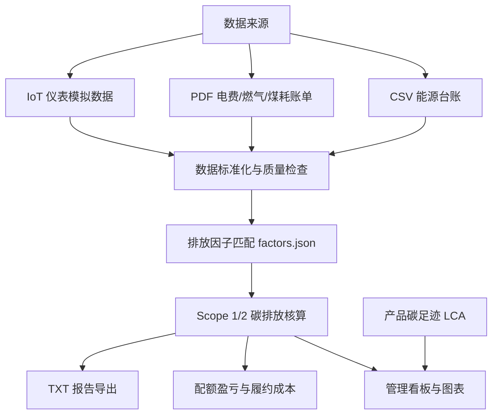

# CarbonScope v4 - 企业碳盘查自动化原型系统

CarbonScope 是一个面向制造企业碳管理场景的轻量级原型系统，重点解决“能源数据分散、人工核算易错、排放因子难追溯、管理层难读懂”的问题。项目由电子科学与技术背景出发，将碳核算、PDF 账单解析、IoT 仪表采集模拟和前端可视化整合到一个可演示的 Web/桌面工具中。

> 定位：面试展示 / 企业内部预核算原型，不是政府正式申报系统。

---

## 系统架构



核心数据流：

1. 导入 CSV、PDF 或 IoT 模拟采集数据。
2. 校验字段、单位、重复项和异常值。
3. 根据 `factors.json` 匹配排放因子。
4. 计算 Scope 1 / Scope 2 排放量。
5. 输出图表、配额风险、减排建议和报告。

---

## 功能模块

| 模块 | 解决的问题 | 实现方式 |
|---|---|---|
| 碳排放核算 | 企业能源数据转成 Scope 1/2 排放 | 活动数据 × 排放因子 |
| 数据质量检查 | 防止错误数据直接进入报告 | 缺字段、负数、0 值、单位、重复记录检查 |
| PDF 账单解析 | 减少人工抄电费单/燃气单 | pdf.js 前端离线解析 + 关键词/单位规则 |
| 因子追溯 | 避免因子写死、无法审计 | `data/factors.json` 独立维护 |
| 配额盈亏 | 管理层关注履约成本 | 免费配额 - 实际排放 × 碳价 |
| 产品碳足迹 | 估算单件产品碳排放 | 原材料 + 制造用电 + 运输 + 废品率 |
| IoT 仪表模拟 | 展示电子专业和碳数据自动化结合 | MODBUS 仪表采集模拟 |
| 报告导出 | 输出可读的内部盘查结果 | TXT 报告，包含数据来源和因子说明 |

---

## 使用方法

### 1. Web 版

直接双击项目根目录的：

```text
index.html
```

浏览器会打开 CarbonScope 页面，默认加载演示数据。

### 2. GitHub Pages 版

仓库部署到 GitHub Pages 后，可直接访问：

```text
https://ak111nice.github.io/carbonscope/
```

注意：PDF 解析依赖以下文件，必须位于 `data/` 目录：

```text
data/pdf.min.js
data/pdf.worker.min.js
```

### 3. 桌面版

如果已打包，可双击：

```text
dist/CarbonScope.exe
```

### 4. Python 命令行

```bash
cd src
python carbon_v2.py csv ../data/sample_energy_data.csv
python carbon_v2.py pdf ../data/电力账单_2025年7月.pdf
python iot_collector.py
```

---

## 技术栈

前端：

- HTML / CSS / JavaScript
- Chart.js：排放结构和 Scope 图表
- pdf.js：前端离线 PDF 文字提取

后端与脚本：

- Python
- pandas / numpy：数据处理与核算
- pdfplumber：Python 版 PDF 解析
- Streamlit：Python Web 仪表盘版本
- PyInstaller / pywebview：桌面 exe 打包

碳管理相关：

- GB/T 32150 温室气体核算思路
- ISO 14067 产品碳足迹思路
- Scope 1 / Scope 2 分类
- 碳配额、履约成本、排放因子追溯

IoT / 嵌入式：

- MODBUS 仪表采集模拟
- 电表、气表、煤仓皮带秤、柴油地磅等能源计量场景

---

## 项目结构

```text
碳中和项目/
├── index.html                  Web 主入口
├── data/
│   ├── factors.json            排放因子库
│   ├── chart.min.js            图表库
│   ├── pdf.min.js              PDF 解析库
│   └── pdf.worker.min.js       PDF worker
├── src/
│   ├── carbon_v2.py            核心核算、PDF、LCA、报告逻辑
│   ├── pdf_parser_cn.py        中文 PDF 解析增强版
│   ├── iot_collector.py        MODBUS 仪表采集模拟
│   ├── factor_updater.py       因子来源更新检测
│   └── app.py                  Streamlit 版本
├── dist/                       桌面版输出目录
├── docs/                       项目说明文档
└── outputs/                    报告和图表输出
```

---

## 核心公式

碳排放核算：

```text
碳排放量(tCO2e) = 活动数据 × 排放因子
```

配额盈亏：

```text
配额差 = 免费配额 - 实际排放量
履约成本 = max(0, 实际排放量 - 免费配额) × 碳价
```

产品碳足迹：

```text
产品碳足迹 = (原材料排放 + 制造用电排放 + 运输排放) × (1 + 废品率)
```

---

## 面试可讲亮点

- 不只是做计算器，而是模拟企业真实流程：数据采集、数据校验、因子匹配、Scope 核算、配额风险和报告输出。
- PDF 解析设置人工确认，体现碳盘查数据需要可追溯、可复核。
- 因子库独立维护，方便解释“为什么不能把排放因子写死在代码里”。
- IoT 模块体现电子科学与技术专业优势，可延伸到电表、气表、能源计量设备和碳数据平台。
- GitHub Pages 可在线演示，降低面试官体验成本。

---

## 限制与后续优化

- 当前报告用于内部预核算和面试展示，不能直接作为政府正式申报文件。
- 扫描版 PDF 需要 OCR，本项目当前主要支持文字版 PDF。
- 后续可扩展企业组织边界、核算年度、原始凭证归档、第三方核查导出模板和数据库持久化。
